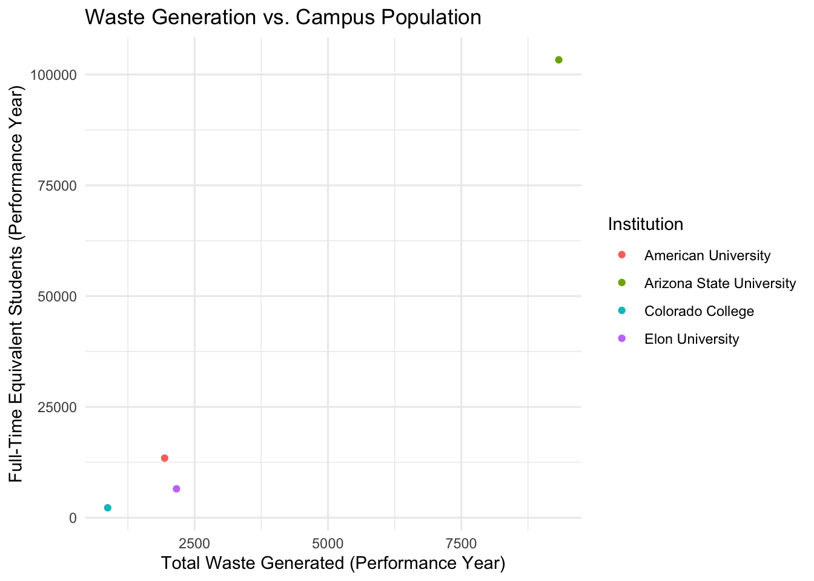
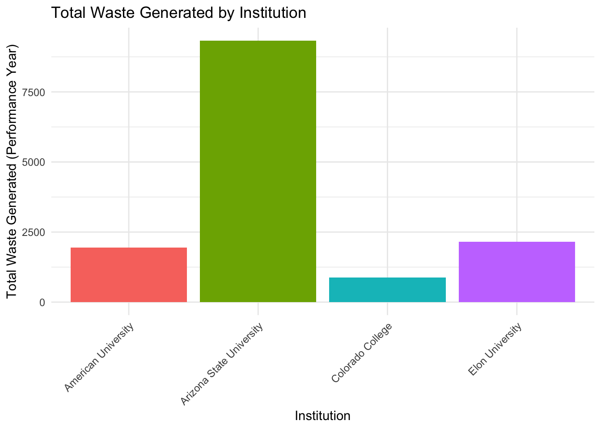
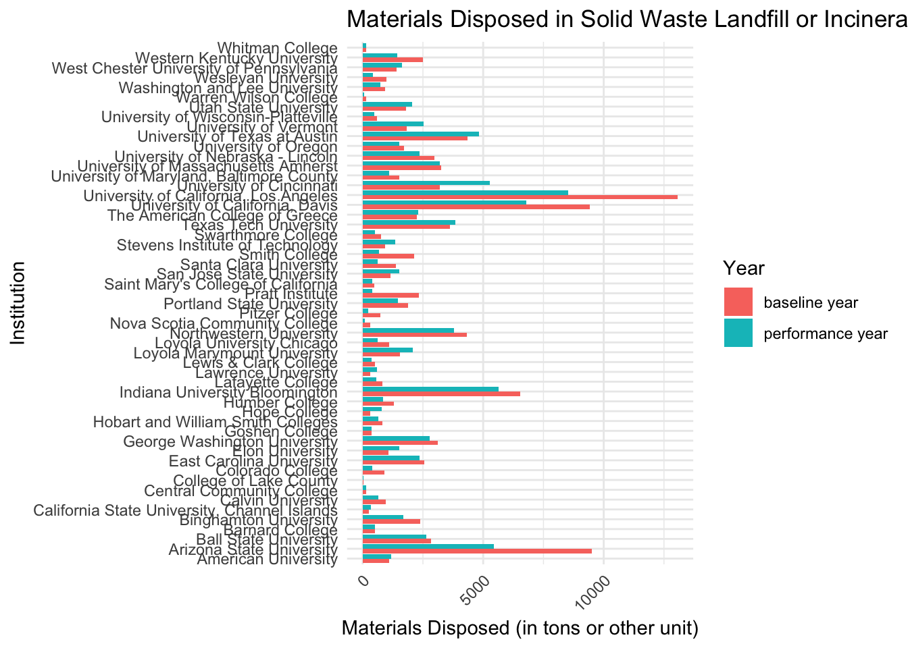
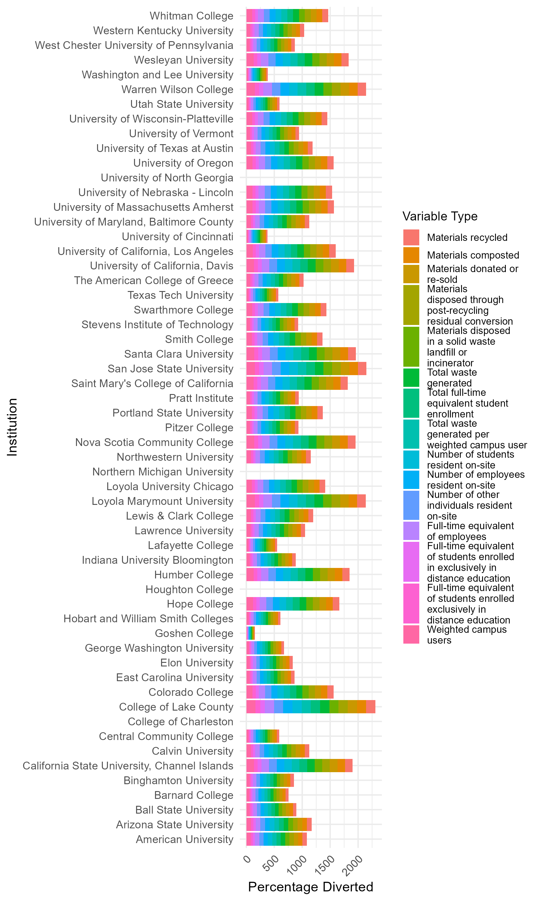

```{css, echo=FALSE}
  h1 {
    font-size: 65px;  
    font-weight: bold;           
                 
  }

```

```         
## -   By Tenzin Dhondup, Nimo Hassan, Breanna Ranglall, Alexander Wodarski
```

**For our final group project in DASC 130, we were assigned five different credit areas by the Office of Sustainability Initiatives (OSI): AC-8: Campus as Living Lab, OP-2: Greenhouse Gas Emissions, OP-16: Commute Modal Split, OP-18: Waste Minimization and Diversion, and OP-21: Water Use. Our team decided to focus on OP-18: Waste Minimization and Diversion, comparing statistics between the University of St. Thomas and other Minnesota peer institutions. Our main objectives from OSI were to examine changes over time in this credit area, analyze St. Thomas’s performance in comparison to our peer institutions, and present our findings in a more visually engaging manner. We have provided a self-contained and reproducible document that can help you analyze different statistics we have found interesting to review and take into consideration.**

````         
## Data Tidying/Wrangling

```{r }
# Loading needed libraries 
#| warning: false
library(tidyverse)
library(readxl)
library(dplyr)
```

-   **Read data from excel spreadsheet**

```{r}

data <- read_excel("OP-18_Waste_Minimization_and_Diversion_2020.xlsx")
```

-   **Converting 'chr' to 'numeric'**

```{r}
#| warning: false
df <- data

df$'Materials recycled, performance year' <- as.numeric(df$'Materials recycled, performance year')
df$'Materials recycled, baseline year' <- as.numeric(df$'Materials recycled, baseline year')
df$'Materials composted, performance year' <- as.numeric(df$'Materials composted, performance year')
df$'Materials composted, baseline year' <- as.numeric(df$'Materials composted, baseline year')
df$'Materials donated or re-sold, performance year' <- as.numeric(df$'Materials donated or re-sold, performance year')
df$'Materials donated or re-sold, baseline year' <- as.numeric(df$'Materials donated or re-sold, baseline year')
df$'Materials disposed through post-recycling residual conversion, performance year' <- as.numeric(df$'Materials disposed through post-recycling residual conversion, performance year')
df$'Materials disposed through post-recycling residual conversion, baseline year' <- as.numeric(df$'Materials disposed through post-recycling residual conversion, baseline year')
df$'Materials disposed in a solid waste landfill or incinerator, performance year' <- as.numeric(df$'Materials disposed in a solid waste landfill or incinerator, performance year')
df$'Materials disposed in a solid waste landfill or incinerator, baseline year' <- as.numeric(df$'Materials disposed in a solid waste landfill or incinerator, baseline year')
df$'Total waste generated, performance year' <- as.numeric(df$'Total waste generated, performance year')
df$'Total waste generated, baseline year' <- as.numeric(df$'Total waste generated, baseline year')
df$'Start date, performance year or 3-year period' <- as.numeric(df$'Start date, performance year or 3-year period')
df$'End date, performance year or 3-year period' <- as.numeric(df$'End date, performance year or 3-year period')
df$'Start date, baseline year or 3-year period' <- as.numeric(df$'Start date, baseline year or 3-year period')
df$'End date, baseline year or 3-year period' <- as.numeric(df$'End date, baseline year or 3-year period')
df$'Number of students resident on-site, performance year' <- as.numeric(df$'Number of students resident on-site, performance year')
df$'Number of students resident on-site, baseline year' <- as.numeric(df$'Number of students resident on-site, baseline year')
df$'Number of employees resident on-site, performance year' <- as.numeric(df$'Number of employees resident on-site, performance year')
df$'Number of employees resident on-site, baseline year' <- as.numeric(df$'Number of employees resident on-site, baseline year')
df$'Number of other individuals resident on-site, performance year' <- as.numeric(df$'Number of other individuals resident on-site, performance year')
df$'Number of other individuals resident on-site, baseline year' <- as.numeric(df$'Number of other individuals resident on-site, baseline year')
df$'Total full-time equivalent student enrollment, performance year' <- as.numeric(df$'Total full-time equivalent student enrollment, performance year')
df$'Total full-time equivalent student enrollment, baseline year' <- as.numeric(df$'Total full-time equivalent student enrollment, baseline year')
df$'Full-time equivalent of employees, performance year' <- as.numeric(df$'Full-time equivalent of employees, performance year')
df$'Full-time equivalent of employees, baseline year' <- as.numeric(df$'Full-time equivalent of employees, baseline year')
df$'Full-time equivalent of students enrolled in exclusively in distance education, performance year' <- as.numeric(df$'Full-time equivalent of students enrolled in exclusively in distance education, performance year')
df$'Full-time equivalent of students enrolled exclusively in distance education, baseline year' <- as.numeric(df$'Full-time equivalent of students enrolled exclusively in distance education, baseline year')
df$'Weighted campus users, performance year' <- as.numeric(df$'Weighted campus users, performance year')
df$'Weighted campus users, baseline year' <- as.numeric(df$'Weighted campus users, baseline year')
df$'Total waste generated per weighted campus user, performance year' <- as.numeric(df$'Total waste generated per weighted campus user, performance year')
df$'Total waste generated per weighted campus user, baseline year' <- as.numeric(df$'Total waste generated per weighted campus user, baseline year')
df$'Weighted campus users, performance year' <- as.numeric(df$'Weighted campus users, performance year')
df$'Weighted campus users, baseline year' <- as.numeric(df$'Weighted campus users, baseline year')
df$'Percentage reduction in total waste generated per weighted campus user from baseline' <- as.numeric(df$'Percentage reduction in total waste generated per weighted campus user from baseline')
df$'Percentage of materials diverted from the landfill or incinerator by recycling, composting, ...' <- as.numeric(df$'Percentage of materials diverted from the landfill or incinerator by recycling, composting, ...')
df$'Percentage of materials diverted from the landfill or incinerator (including up to 10 percent ...' <- as.numeric(df$'Percentage of materials diverted from the landfill or incinerator (including up to 10 percent ...')
```

-   **Converting 'chr' to 'date'**

```{r}
#| warning: false

df$'Last Updated' <- as.Date(df$'Last Updated')
df$'Start date, performance year or 3-year period' <- as.Date(df$'Start date, performance year or 3-year period', origin = "1899-12-30")
df$'End date, performance year or 3-year period' <- as.Date(df$'End date, performance year or 3-year period', origin = "1899-12-30")
df$'Start date, baseline year or 3-year period' <- as.Date(df$'Start date, baseline year or 3-year period', origin = "1899-12-30")
df$'End date, baseline year or 3-year period' <- as.Date(df$'End date, baseline year or 3-year period', origin = "1899-12-30")

```

-   **Converting df from wide format to long format**

```{r}
#| warning: false

df_long <- df |>
  select(Institution, where(is.numeric)) |>
  pivot_longer(
    cols = starts_with("Materials") | starts_with("Total") | starts_with("Number") | starts_with("Full-Time") | starts_with("Weighted"),
    names_to = c("Variable_Type", "Year"),
    names_sep = ", ",
    values_to = "Amount"
  )
```

-   **Combining Tidy Numeric Data with Non Numeric Data**

```{r}
#| warning: false


df_non_numeric <- df |>
  select(where(~ !is.numeric(.)))

data_test <- left_join(df_long, df_non_numeric, by = "Institution")

```
````

### - Testing filtering by a university in institution

```{{r}}
#| warning: false

filter_test <- data_test |>
  filter(Institution == "American University")

```

## Summary Statistics

::: panel-tabset
### Summary

```{r eval=FALSE}
peer_schools<-c("Bemidji State University","Carleton College","College of St. Benedict/St. John’s University", "Concordia Moorhead","Macalester College","Winona State University","University of Minnesota, Twin Cities","University of Minnesota, Morris","UMN – Duluth","Augsburg University","Concordia in St. Paul","Hamline University","St. Kate’s University","St. Olaf College","University of St. Thomas")
peers <-  df|>
  filter(Institution %in% peer_schools)
# Summary statistics for all numeric variables
numeric_summary <- peers |>
  summarize(across(where(is.numeric), list(
    mean = ~ mean(.x, na.rm = TRUE),
    median = ~ median(.x, na.rm = TRUE),
    sd = ~ sd(.x, na.rm = TRUE),
    min = ~ min(.x, na.rm = TRUE),
    max = ~ max(.x, na.rm = TRUE)
  )))
View(peers)
View(numeric_summary)
```
:::

**As we were comparing the University of St. Thomas with all the summary statistics of other institutions, we realized that the University of Minnesota Twin Cities significantly impacts the results. Since the University of Minnesota Twin Cities is much larger compared to other institutions, it skews the data, causing St. Thomas to appear below the average in several statistics. The main reason for this difference is likely caused by the fact that the University of Minnesota Twin Cities is much larger compared to other institutions, which naturally leads to higher numbers. St. Thomas's rank tends to fluncuate between 2nd and 3rd place in comparison to the University of Minnesota Twin Cities; it often competes with Carleton College, which has similar statistics across most variables.**

## Data Visuilzations

::: panel-tabset
### Waste Generation vs. Campus Population

```{r,echo=FALSE}



```

**This graph compares waste generations with student populations across institutions based on the performance year. The x-axis represent the total waste generated, while the y-axis show the student populations, categorized by the full-time student status. The graph is trying to show the relationship between waste generation and student population, highlighting patterns among American University, Arizona State University, Colorado College, and Elon University.**

### Code

```{r eval=FALSE}
  #| warning: false
    # Filter waste and enrollment data separately, then join them
    waste_data <- data_test |>
      filter(Institution %in% c("American University", "Arizona State University", "Colorado College", "Elon University")) |>
      filter(Variable_Type == "Total waste generated") |>
      filter(Year == "performance year") |>
      filter(!is.na(Amount)) |>
      select(Institution, Amount, Variable_Type, Year)

    enrollment_data <- data_test |>
      filter(Institution %in% c("American University", "Arizona State University", "Colorado College", "Elon University")) |>
      filter(Variable_Type == "Total full-time equivalent student enrollment") |>
      filter(Year == "performance year") |>
      filter(!is.na(Amount)) |>
      select(Institution, Amount, Variable_Type, Year)

    # Join the two datasets on Institution
    merged_data <- left_join(waste_data, enrollment_data, by = "Institution", suffix = c("_waste", "_enrollment"))

    # Plot the data
    ggplot(merged_data, aes(x = Amount_waste, y = Amount_enrollment)) +
      geom_point(aes(color = Institution)) +
      labs(title = "Waste Generation vs. Campus Population",
           x = "Total Waste Generated (Performance Year)",
           y = "Full-Time Equivalent Students (Performance Year)") +
      theme_minimal()
```
:::

::: panel-tabset
### Total Waste Generated by Institution

```{r,echo=FALSE}


```

**This graph is comparing total waste generated across American University, Arizona State University, Colorado College, and Elon University. The x-axis represents the institutions, while the y-axis shows the total waste generated by each institution, based on the performance year. As you can see in the bar plot, Arizona State University generates significantly more waste compared to the other three institutions."**

### Code

```{r eval=FALSE}

# Bar Plot: Total Waste Generated by Institution
ggplot(merged_data, aes(x = Institution, y = Amount_waste, fill = Institution)) +
  geom_bar(stat = "identity", show.legend = FALSE) +
  labs(title = "Total Waste Generated by Institution",
       x = "Institution",
       y = "Total Waste Generated (Performance Year)") +
  theme_minimal() +
  theme(axis.text.x = element_text(angle = 45, hjust = 1))

```
:::

::: panel-tabset
### Materials Disposed in Solid Waste Landfill or Incinerator

```{r ,echo=FALSE}


```

**This data visualization contains two bar plots: one for the baseline year and one for the performance year, representing the disposal of materials in solid waste landfill or incinerator. The x-axis for both bar plots represent the institutions, while the y-axis show the amount of materials disposed of in tons(or other units of measurements). As seen in the graph, many of the longer bars in reference to higher disposal amounts are appearing within the baseline year. From this we can infer that higher volume of materials are likely being disposed of compared to the performance year among institutions.**

### Code

```{r eval=FALSE}
# Ensure data includes the baseline year and relevant materials information
ggplot(data_test |>
         filter(Variable_Type == "Materials disposed in a solid waste landfill or incinerator") |>
         filter(Year %in% c("performance year", "baseline year")) |>
         filter(!is.na(Amount)),
       aes(x = Institution, y = Amount, fill = Year)) +
  geom_bar(stat = "identity", position = "dodge", show.legend = TRUE) +
  labs(title = "Materials Disposed in Solid Waste Landfill or Incinerator (Performance vs. Baseline Year)",
       x = "Institution",
       y = "Materials Disposed (in tons or other unit)") +
  theme_minimal() +
  coord_flip()+
  theme(axis.text.x = element_text(angle = 45, hjust = 1))
```
:::

::: panel-tabset
### Institutional Waste Diversion Performance by Material Type

```{r ,echo=FALSE}


```

**The graph is visualizing institutional waste diversion performance by material type. The x-axis represent different institutions, while the y-axis shows the percentage of materials diverted from landfill or incinerator, categorized by material type. In this visualization you can see that each material type is being represented by different color, providing an easier comparison of waste diversion performance across institutions.**

### Code

```{r, eval=FALSE}
#| warning: false
library(scales)
library(stringr)
# Convert 'Institution' and 'Variable_Type' to factors to ensure they work well with geom_tile
data_test$Institution <- as.factor(data_test$Institution)
data_test$Variable_Type <- as.factor(data_test$Variable_Type)
# Wrap the text in Variable_Type to create line breaks for legend labels
data_test$Variable_Type <- factor(
  str_wrap(data_test$Variable_Type, width = 30), 
  levels = unique(str_wrap(data_test$Variable_Type, width = 30))
)
wrapped_title <- str_wrap("Institutional Waste Diversion Performance by Material Type", width = 30)
# Plot using geom_col to visualize the categories
ggplot(data_test, aes(x = Institution, y = `Percentage of materials diverted from the landfill or incinerator by recycling, composting, ...`, fill = Variable_Type)) +
  geom_col() +
  theme_minimal() +
  labs(
    title = wrapped_title,
    x = "Institution",
    y = "Percentage Diverted",
    fill = "Variable Type",
    caption = "Source: AASHE STAR"
  ) +
  theme(
    legend.text = element_text(size = 8),  # Make legend text smaller
    legend.title = element_text(size = 10), # Adjust legend title size
    legend.key.size = unit(0.5, "cm"),  # Reduce legend key size
    legend.spacing.y = unit(0.2, "cm")    # Reduce space between legend items
  ) +
  coord_flip()
```
:::
