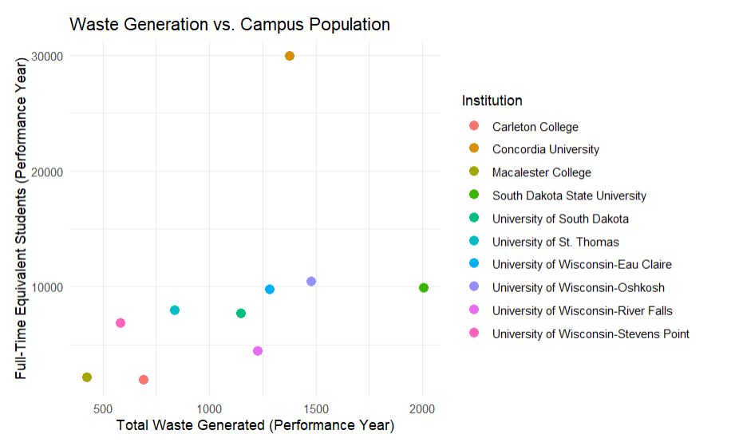
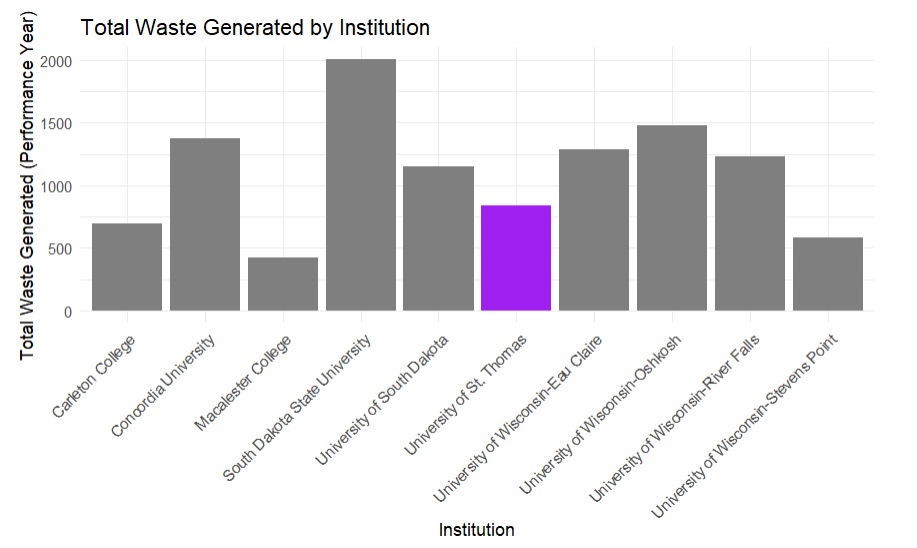
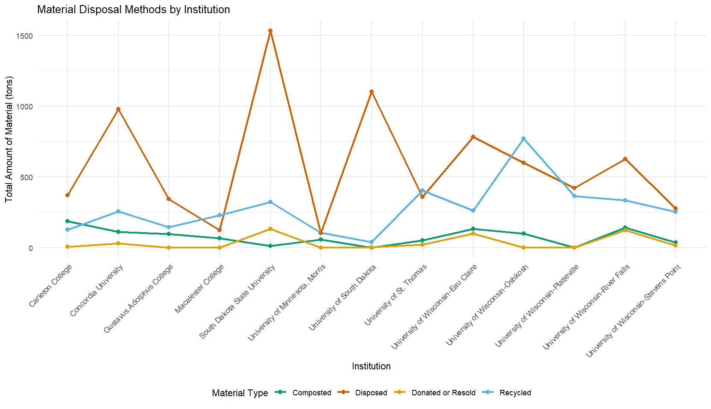
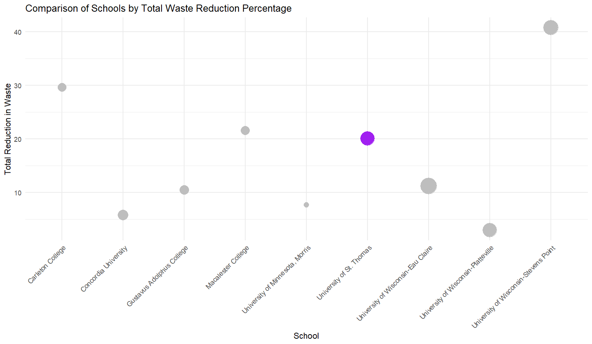

```{css, echo=FALSE}
  h1 {
    font-size: 65px;  
    font-weight: bold;           
                 
  }

```

```         
## -   By Tenzin Dhondup, Nimo Hassan, Breanna Ranglall, Alexander Wodarski
```

**For our final group project in DASC 130, we were assigned five different credit areas by the Office of Sustainability Initiatives (OSI): AC-8: Campus as Living Lab, OP-2: Greenhouse Gas Emissions, OP-16: Commute Modal Split, OP-18: Waste Minimization and Diversion, and OP-21: Water Use. Our team decided to focus on OP-18: Waste Minimization and Diversion, comparing statistics between the University of St. Thomas and other Minnesota peer institutions. Our main objectives from OSI were to examine changes over time in this credit area, analyze St. Thomas’s performance in comparison to our peer institutions, and present our findings in a more visually engaging manner. We have provided a self-contained and reproducible document that can help you analyze different statistics we have found interesting to review and take into consideration.**

````         
## Data Tidying/Wrangling

```{r }
#| warning: false

# Loading needed libraries 
library(tidyverse)
library(readxl)
library(dplyr)
```

-   **Read data from excel spreadsheets**

```{r}
# Read data from excel spreadsheet

dataf <- read_excel("OP-18_Waste_Minimization_and_Diversion_2024.xlsx")
pop_data <- read.csv("updated_school_population.csv")
```

-   **Converting 'chr' to 'numeric'**

```{r}
#| warning: false
dataframe <- dataf

# Converting 'chr' to 'numeric'

dataframe$'Materials recycled, performance year' <- as.numeric(dataframe$'Materials recycled, performance year')
dataframe$'Materials recycled, baseline year' <- as.numeric(dataframe$'Materials recycled, baseline year')
dataframe$'Materials composted, performance year' <- as.numeric(dataframe$'Materials composted, performance year')
dataframe$'Materials composted, baseline year' <- as.numeric(dataframe$'Materials composted, baseline year')
dataframe$'Materials donated or re-sold, performance year' <- as.numeric(dataframe$'Materials donated or re-sold, performance year')
dataframe$'Materials donated or re-sold, baseline year' <- as.numeric(dataframe$'Materials donated or re-sold, baseline year')
dataframe$'Materials disposed through post-recycling residual conversion, performance year' <- as.numeric(dataframe$'Materials disposed through post-recycling residual conversion, performance year')
dataframe$'Materials disposed through post-recycling residual conversion, baseline year' <- as.numeric(dataframe$'Materials disposed through post-recycling residual conversion, baseline year')
dataframe$'Materials disposed in a solid waste landfill or incinerator, performance year' <- as.numeric(dataframe$'Materials disposed in a solid waste landfill or incinerator, performance year')
dataframe$'Materials disposed in a solid waste landfill or incinerator, baseline year' <- as.numeric(dataframe$'Materials disposed in a solid waste landfill or incinerator, baseline year')
dataframe$'Total waste generated, performance year' <- as.numeric(dataframe$'Total waste generated, performance year')
dataframe$'Total waste generated, baseline year' <- as.numeric(dataframe$'Total waste generated, baseline year')
dataframe$'Start date, performance year or 3-year period' <- as.numeric(dataframe$'Start date, performance year or 3-year period')
dataframe$'End date, performance year or 3-year period' <- as.numeric(dataframe$'End date, performance year or 3-year period')
dataframe$'Start date, baseline year or 3-year period' <- as.numeric(dataframe$'Start date, baseline year or 3-year period')
dataframe$'End date, baseline year or 3-year period' <- as.numeric(dataframe$'End date, baseline year or 3-year period')
dataframe$'Number of students resident on-site, performance year' <- as.numeric(dataframe$'Number of students resident on-site, performance year')
dataframe$'Number of students resident on-site, baseline year' <- as.numeric(dataframe$'Number of students resident on-site, baseline year')
dataframe$'Number of employees resident on-site, performance year' <- as.numeric(dataframe$'Number of employees resident on-site, performance year')
dataframe$'Number of employees resident on-site, baseline year' <- as.numeric(dataframe$'Number of employees resident on-site, baseline year')
dataframe$'Number of other individuals resident on-site, performance year' <- as.numeric(dataframe$'Number of other individuals resident on-site, performance year')
dataframe$'Number of other individuals resident on-site, baseline year' <- as.numeric(dataframe$'Number of other individuals resident on-site, baseline year')
dataframe$'Total full-time equivalent student enrollment, performance year' <- as.numeric(dataframe$'Total full-time equivalent student enrollment, performance year')
dataframe$'Total full-time equivalent student enrollment, baseline year' <- as.numeric(dataframe$'Total full-time equivalent student enrollment, baseline year')
dataframe$'Full-time equivalent of employees, performance year' <- as.numeric(dataframe$'Full-time equivalent of employees, performance year')
dataframe$'Full-time equivalent of employees, baseline year' <- as.numeric(dataframe$'Full-time equivalent of employees, baseline year')
dataframe$'Full-time equivalent of students enrolled in exclusively in distance education, performance year' <- as.numeric(dataframe$'Full-time equivalent of students enrolled in exclusively in distance education, performance year')
dataframe$'Full-time equivalent of students enrolled exclusively in distance education, baseline year' <- as.numeric(dataframe$'Full-time equivalent of students enrolled exclusively in distance education, baseline year')
dataframe$'Weighted campus users, performance year' <- as.numeric(dataframe$'Weighted campus users, performance year')
dataframe$'Weighted campus users, baseline year' <- as.numeric(dataframe$'Weighted campus users, baseline year')
dataframe$'Total waste generated per weighted campus user, performance year' <- as.numeric(dataframe$'Total waste generated per weighted campus user, performance year')
dataframe$'Total waste generated per weighted campus user, baseline year' <- as.numeric(dataframe$'Total waste generated per weighted campus user, baseline year')
dataframe$'Weighted campus users, performance year' <- as.numeric(dataframe$'Weighted campus users, performance year')
dataframe$'Weighted campus users, baseline year' <- as.numeric(dataframe$'Weighted campus users, baseline year')
dataframe$'Percentage reduction in total waste generated per weighted campus user from baseline' <- as.numeric(dataframe$'Percentage reduction in total waste generated per weighted campus user from baseline')
dataframe$'Percentage of materials diverted from the landfill or incinerator by recycling, composting, ...' <- as.numeric(dataframe$'Percentage of materials diverted from the landfill or incinerator by recycling, composting, ...')
dataframe$'Percentage of materials diverted from the landfill or incinerator (including up to 10 percent ...' <- as.numeric(dataframe$'Percentage of materials diverted from the landfill or incinerator (including up to 10 percent ...')
# Replace the single NA with 0
# Replace NA values with 0 for the specified columns
dataframe$`Total waste generated, baseline year`[is.na(dataframe$`Total waste generated, baseline year`)] <- 0
dataframe$`Weighted campus users, baseline year`[is.na(dataframe$`Weighted campus users, baseline year`)] <- 0
dataframe$`Total waste generated, performance year`[is.na(dataframe$`Total waste generated, performance year`)] <- 0
dataframe$`Weighted campus users, performance year`[is.na(dataframe$`Weighted campus users, performance year`)] <- 0
dataframe$`Materials recycled, performance year`[is.na(dataframe$`Materials recycled, performance year`)] <- 0
dataframe$`Materials composted, performance year`[is.na(dataframe$`Materials composted, performance year`)] <- 0
dataframe$`Materials donated or re-sold, performance year`[is.na(dataframe$`Materials donated or re-sold, performance year`)] <- 0
dataframe$`Materials disposed in a solid waste landfill or incinerator, performance year`[is.na(dataframe$`Materials disposed in a solid waste landfill or incinerator, performance year`)] <- 0
```

-   **Rename some Universities**

```{r}
pop_data$Institution[pop_data$Institution == "University of Minnesota Twin Cities"] <- "University of Minnesota, Twin Cities"
pop_data$Institution[pop_data$Institution == "University of Minnesota Crookston"] <- "University of Minnesota, Crookston"
pop_data$Institution[pop_data$Institution == "University of Minnesota Morris"] <- "University of Minnesota, Morris"
```


-   **Converting 'chr' to 'date'**

```{r}
#| warning: false

dataframe$'Last Updated' <- as.Date(dataframe$'Last Updated')
dataframe$'Start date, performance year or 3-year period' <- as.Date(dataframe$'Start date, performance year or 3-year period', origin = "1899-12-30")
dataframe$'End date, performance year or 3-year period' <- as.Date(dataframe$'End date, performance year or 3-year period', origin = "1899-12-30")
dataframe$'Start date, baseline year or 3-year period' <- as.Date(dataframe$'Start date, baseline year or 3-year period', origin = "1899-12-30")
dataframe$'End date, baseline year or 3-year period' <- as.Date(dataframe$'End date, baseline year or 3-year period', origin = "1899-12-30")
pop_data$Undergraduate.Population <- as.numeric(pop_data$Undergraduate.Population)

```

-   **Combine Both Spreadsheets**

```{r}
#| warning: false

peer_schools <- c("Iowa State University", "University of Minnesota, Twin Cities", "University of St. Thomas", 
                  "Macalester College", "Gustavus Adolphus College", "University of Wisconsin-Madison", 
                  "Marquette University", "University of Wisconsin-Eau Claire", 
                  "University of Wisconsin-Green Bay", "University of Wisconsin-Oshkosh", 
                  "University of Wisconsin-Platteville", "University of Wisconsin-Stevens Point", 
                  "University of Wisconsin-River Falls", "University of Minnesota, Morris", 
                  "University of Minnesota, Crookston","Concordia University",
                  "Carleton College", "South Dakota State University", 
                  "University of South Dakota")
schools_to_exclude <- c("Marquette University", "University of Wisconsin-Green Bay", "University of Minnesota, Crookston")
peers <-  dataframe|>
  filter(Institution %in% peer_schools)|>
  left_join(pop_data,by = "Institution")|>
  filter(Undergraduate.Population<11000)|>
  filter(!Institution %in% schools_to_exclude)|>
  mutate(
  `Reduction in Total Waste per Person` = 5 * (
    (
      (`Total waste generated, baseline year` / `Weighted campus users, baseline year`) - 
      (`Total waste generated, performance year` / `Weighted campus users, performance year`)
    ) / 
    (`Total waste generated, baseline year` / `Weighted campus users, baseline year`)
  ),
  
  `Total waste per person` = 2.78 * (
    (
      0.46 - 
      (`Total waste generated, performance year` / `Weighted campus users, performance year`) / 0.46
    )
  ),
  
  `Waste diverted from the landfill or incinerator` = 3 * (
    (
      (
        `Materials recycled, performance year` + 
        `Materials composted, performance year` + 
        `Materials donated or re-sold, performance year` +
        (0.1 * (
          `Materials recycled, performance year` + 
          `Materials composted, performance year` + 
          `Materials donated or re-sold, performance year` + 
          `Materials disposed in a solid waste landfill or incinerator, performance year`
        ))
      ) / 
      (
        `Materials recycled, performance year` + 
        `Materials composted, performance year` + 
        `Materials donated or re-sold, performance year` + 
        `Materials disposed in a solid waste landfill or incinerator, performance year`
      )
    )
  )
)
```


## Summary Statistics

::: panel-tabset
### Summary

```{r eval=FALSE}
numeric_summary <- peers |>
  summarize(across(where(is.numeric), list(
    mean = ~ mean(.x, na.rm = TRUE),
    median = ~ median(.x, na.rm = TRUE),
    sd = ~ sd(.x, na.rm = TRUE),
    min = ~ min(.x, na.rm = TRUE),
    max = ~ max(.x, na.rm = TRUE)
  )))
View(peers)
```
:::

**While looking at the mn peer institutions we saw that there weren't many schools to compare to so we decided to gather schools from North Dakota, South Dakota, Iowa, and Wisconsin to have more schools to compare to. We made a new csv of those schools with their populations and we filtered it. From there we saw the big outliers so we filtered out any school with undergraduate populations over 11000. The last thing we did is filter out schools who didn't report data and couldn't have their scores calculated. Those are in the schools to exclude list. We decided to add the scores, we got the equations from the aaeshe stars website, and had to do a little work with the data to change the na variables to 0 so that each institution outputted a score.**

## Data Visuilzations

::: panel-tabset
### Waste Generation vs. Campus Population

```{r,echo=FALSE}



```

**The analysis examines the relationship between total waste generated and the full-time equivalent (FTE) student enrollment for a selection of institutions during the performance year. The dataset was filtered to include institutions of interest, such as the University of St. Thomas, Carleton College, Gustavus Adolphus College, Macalester College, and various universities from South Dakota and Wisconsin. Only data for "Total waste generated" and "Total full-time equivalent student enrollment" were considered, and rows with missing values were excluded. The two datasets were then merged using institution names as the key, resulting in a combined dataset containing waste generation and enrollment figures for each institution.

A scatterplot was created to visualize the relationship between FTE enrollment and waste generation, with each point representing an institution. The x-axis displays FTE student enrollment, while the y-axis shows the total waste generated during the same period. Institutions are distinguished by color, making it easier to identify trends or outliers. The visualization reveals how student population size correlates with waste generation. While larger institutions are generally expected to produce more waste, deviations from this pattern could indicate differences in waste management efficiency. Institutions with higher waste levels relative to enrollment may have opportunities to improve sustainability practices, whereas those with lower waste levels may already be implementing effective measures.**

### Code

```{r eval=FALSE}
 # Converting df from wide format to long format

df_long <- dataframe |>
  select(Institution, where(is.numeric)) |>
  pivot_longer(
    cols = starts_with("Materials") | starts_with("Total") | starts_with("Number") | starts_with("Full-Time") | starts_with("Weighted"),
    names_to = c("Variable_Type", "Year"),
    names_sep = ", ",
    values_to = "Amount"
  )
  
  #Combining Tidy Numeric Data with Non Numeric Data

df_non_numeric <- dataframe |>
  select(where(~ !is.numeric(.)))

data_test <- left_join(df_long, df_non_numeric, by = "Institution")

# Filter waste and enrollment data separately, then join them
waste_data <- data_test |>
  filter(Institution %in% c("University of St. Thomas", "Carleton College", "Concordia University", "	
Gustavus Adolphus College", "Macalester College", "South Dakota State University", "University of South Dakota", "University of Wisconsin-Eau Claire", "University of Wisconsin-Oshkosh", "	
University of Wisconsin-Platteville", "University of Wisconsin-River Falls", "University of Wisconsin-Stevens Point")) |>
  filter(Variable_Type == "Total waste generated") |>
  filter(Year == "performance year") |>
  filter(!is.na(Amount)) |>
  select(Institution, Amount, Variable_Type, Year)

enrollment_data <- data_test |>
  filter(Institution %in% c("University of St. Thomas", "Carleton College", "	
Gustavus Adolphus College", "Macalester College", "South Dakota State University", "University of South Dakota", "University of Wisconsin-Eau Claire", "University of Wisconsin-Oshkosh", "	
University of Wisconsin-Platteville", "University of Wisconsin-River Falls", "University of Wisconsin-Stevens Point")) |>
  filter(Variable_Type == "Total full-time equivalent student enrollment") |>
  filter(Year == "performance year") |>
  filter(!is.na(Amount)) |>
  select(Institution, Amount, Variable_Type, Year)

# Join the two datasets on Institution
merged_data <- left_join(waste_data, enrollment_data, by = "Institution", suffix = c("_waste", "_enrollment"))

# Plot the data with a legend
ggplot(merged_data, aes(x = Amount_enrollment, y = Amount_waste)) +
  geom_point(aes(color = Institution), size = 3) +  # Mapping color to Institution for legend
  labs(title = "Waste Generation vs. Campus Population",
       x = "Full-Time Equivalent Students (Performance Year)",
       y = "Total Waste Generated (Performance Year)",
       color = "Institution",
       caption = "Comparison of Total Waste Generation and Campus Population Across Institutions: \nEach point represents an institution, \nwith its total waste generated during the performance year \nplotted against the full-time equivalent student population for the same period.") +  # Legend title
  theme_minimal()
```
:::

::: panel-tabset
### Total Waste Generated by Institution

```{r,echo=FALSE}


```

**The analysis focuses on visualizing the total waste generated by various institutions during the performance year using a bar chart. The dataset includes key institutions such as the University of St. Thomas, Carleton College, Gustavus Adolphus College, Macalester College, and several universities from South Dakota and Wisconsin. The bar chart represents the total waste generated by each institution, with the University of St. Thomas specifically highlighted in purple for emphasis. This visual distinction draws attention to the University of St. Thomas while allowing for easy comparison with other institutions.

Each bar corresponds to the waste generated by an institution, with the y-axis representing the total waste amount and the x-axis displaying the institution names. The chart effectively highlights differences in waste production across campuses, making it clear which institutions generate more or less waste relative to others. By angling the institution names on the x-axis, the chart improves readability, particularly when comparing multiple institutions.**

### Code

```{r eval=FALSE}
# Bar Plot: Total Waste Generated by Institution
ggplot(merged_data, aes(x = Institution, y = Amount_waste, fill = Institution)) +
  geom_bar(stat = "identity", show.legend = FALSE) +
  scale_fill_manual(values = c("University of St. Thomas" = "purple"))+
  labs(title = "Total Waste Generated by Institution",
       x = "Institution",
       y = "Total Waste Generated (Performance Year)",
       caption = "Total Waste Generated by Institution: \nThis bar chart shows the total waste generated by each institution during the performance year, \nhighlighting variations in waste production across campuses. \nThe University of St. Thomas is emphasized in purple for specific focus.") +
  theme_minimal() +
  theme(axis.text.x = element_text(angle = 45, hjust = 1))
```
:::

::: panel-tabset
### Material Disposal Methods by Institution

```{r ,echo=FALSE}


```

**The University of St. Thomas recycles significantly more materials than the overall average of other schools. However, UST composts less compared to the overall average and donates/resells fewer materials relative to the average. Notably, UST disposes of less material in landfills or incinerators compared to the overall average, indicating stronger waste diversion efforts.**

### Code

```{r eval=FALSE}
# Filter relevant columns for visualization
filtered_data_viz3 <- peers |>
  select(
    Institution,
    `Materials recycled, performance year`,
    `Materials composted, performance year`,
    `Materials donated or re-sold, performance year`,
    `Materials disposed in a solid waste landfill or incinerator, performance year`
  )

# Rename columns for simplicity
colnames(filtered_data_viz3) <- c(
  'Institution', 
  'Recycled', 
  'Composted', 
  'Donated or Resold', 
  'Disposed'
)

# pivot the dataframe to long format for visualization
pivot_data <- filtered_data_viz3 |>
  pivot_longer(
    cols = c('Recycled', 'Composted', 'Donated or Resold', 'Disposed'),
    names_to = 'Material_Type',
    values_to = 'Amount'
  )

ggplot(pivot_data, aes(x = Institution, y = Amount, fill = Material_Type)) +
  geom_bar(stat = 'identity') +
  scale_fill_manual(
    values = c(
      'Recycled' = 'blue',
      'Composted' = 'darkgreen',
      'Donated or Resold' = 'orange',
      'Disposed' = 'red'
    )
  ) +
  labs(
    x = 'Institution',
    y = 'Total Amount of Material (tons)',
    title = 'Material Disposal Methods by Institution',
    fill = 'Material Type'
  ) +
  theme_minimal() +
  theme(axis.text.x = element_text(angle = 90, hjust = 1))
```
:::

::: panel-tabset
### Comparison of Schools by Total Waste Reduction Percentage

```{r ,echo=FALSE}


```

**Compared to other institutions, the University of St. Thomas' total reduction in waste is relatively higher and its population size appears to be similarly relative to the majority of other schools. This suggests that St. Thomas's waste reduction efforts are more effective based on the data when considering its population size.**

### Code

```{r, eval=FALSE}
#| warning: false
filtered_data_viz4 <- peers|>
  select(Institution, Undergraduate.Population, 'Percentage reduction in total waste generated per weighted campus user from baseline') |>
  rename(
    School = Institution,
    Population = Undergraduate.Population,
    Total_Waste_Reduction = 'Percentage reduction in total waste generated per weighted campus user from baseline'
  ) |>
  filter(!is.na(School) & !is.na(Population) & !is.na(Total_Waste_Reduction))

# Create a column to distinguish University of St. Thomas from other schools
filtered_data_viz4 <- filtered_data_viz4 |>
  mutate(Color = ifelse(grepl('University of St. Thomas', School), 'purple', 'grey'))

# Create the scatter plot
ggplot(filtered_data_viz4, aes(x = School, y = Total_Waste_Reduction, size = Population, color = Color)) +
  geom_point(shape = 21, fill = filtered_data_viz4$Color) +  # Change shape to circle (shape = 21) or square (shape = 22)
  scale_color_manual(values = c('purple' = 'purple', 'grey' = 'grey')) +
  scale_size(range = c(3, 10)) +  # Adjust the size of the points
  labs(
    x = 'School',
    y = 'Total Reduction in Waste',
    title = 'Comparison of Schools by Total Waste Reduction Percentage'
  ) +
  theme_minimal() +
  theme(
    axis.text.x = element_text(angle = 90, hjust = 1),
    legend.position="none"
  )
```
:::
